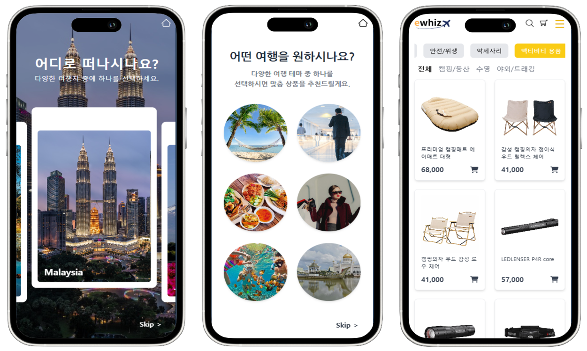
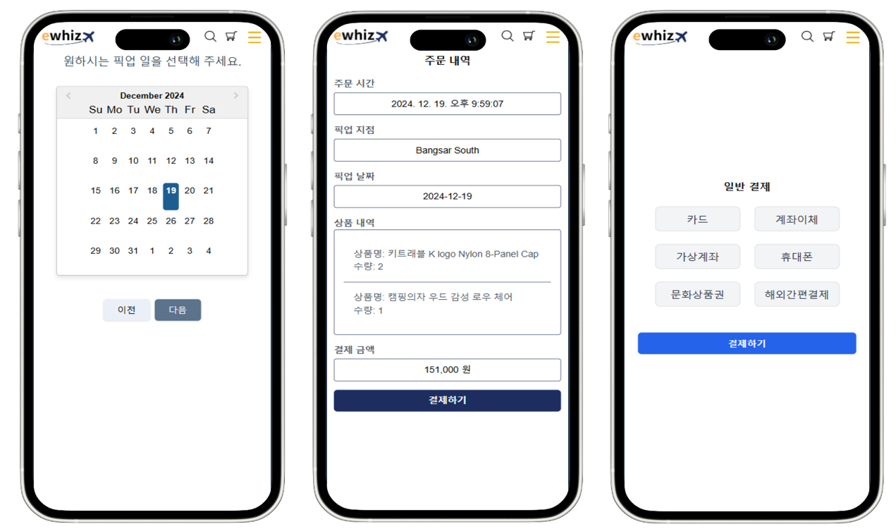
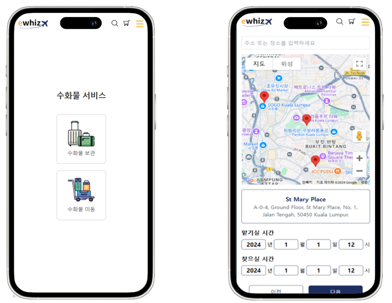
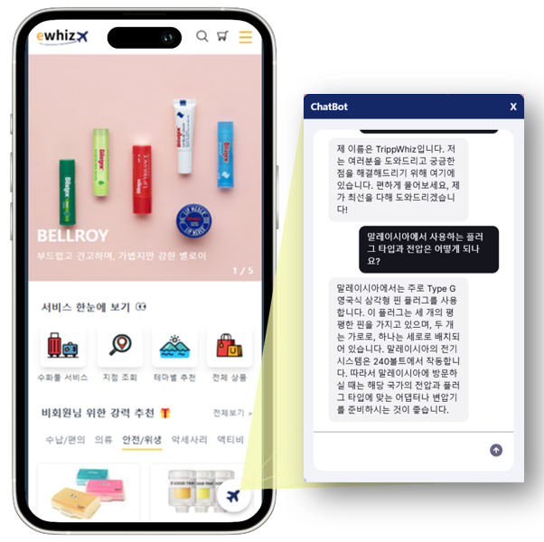

# TripWhiz

> 'AI플랫폼 활용한 (리테일)서비스 개발' 교육프로그램 최종 프로젝트

**TripWhiz**는 해외여행객을 위한 **여행 리테일 + 짐(Luggage) 서비스 플랫폼**입니다.<br>
여행지를 선택한 사용자가 국내에서 상품을 주문/결제하며, 짐 보관/이동 서비스를 신청하고,
QR 코드로 해외 현지의 편의점에서 픽업할 수 있는 모바일 친화적 PWA 서비스입니다.

이 저장소는 **사용자(User) 대상 서비스**의 프론트엔드와 백엔드로 구성되어 있으며,
별도의 **점주(Store Owner) 서버**(`tripwhiz.store`)와 연동됩니다.

---

## 📦 프로젝트 구성

| 디렉터리                                             | 설명                         | 기술 스택                                                |
| ---------------------------------------------------- | ---------------------------- | -------------------------------------------------------- |
| [tripwhiz-user-front-dev/](tripwhiz-user-front-dev/) | 사용자용 웹 프론트엔드 (PWA) | React 18, TypeScript, Vite, Tailwind CSS, Zustand        |
| [tripwhiz-user-back-dev/](tripwhiz-user-back-dev/)   | 사용자용 백엔드 API 서버     | Spring Boot 3.5, Java 17, JPA, QueryDSL, Spring Security |

---

## ✨ 주요 기능

| 기능                       | 설명                                                                |
| -------------------------- | ------------------------------------------------------------------- |
| **여행지/테마 선택**       | 국가별 여행지 선택 및 테마 기반 상품 탐색                           |
| **상품 / 카테고리**        | 카테고리, 서브카테고리 기반 상품 목록 및 상세 조회                  |
| **장바구니 / 주문 / 결제** | 장바구니 담기, 주문 생성, **토스페이먼츠(Toss Payments)** 연동 결제 |
| **짐(Luggage) 서비스**     | 짐 보관 및 짐 이동 신청/상태 관리                                   |
| **QR 코드**                | 주문/픽업용 QR 코드 생성(ZXing) 및 스캔 처리                        |
| **지도**                   | Google Maps 기반 매장/픽업 위치 표시                                |
| **소셜 로그인**            | Google / Kakao OAuth2 로그인, JWT 기반 인증                         |
| **푸시 알림**              | Firebase Cloud Messaging(FCM)을 통한 실시간 알림                    |
| **챗봇**                   | nlux 기반 AI 챗봇 상담 UI                                           |
| **마이페이지**             | 주문 내역, QR, 공지사항, 고객센터 등                                |

<br>

- 여행지/테마 선택 & 선택 기반 상품 리스트<br>


- 픽업 날짜 선택 & 주문/결제<br>


- 수화물 보관/이동<br>


- 챗봇 UI<br>


---

## 🛠 기술 스택

### Frontend (`tripwhiz-user-front-dev`)

- **React 18 + TypeScript + Vite**
- **Tailwind CSS** - 스타일링
- **Zustand** - 전역 상태 관리 (Auth / Cart)
- **React Router v6** - 라우팅 (lazy 로딩 기반 코드 스플리팅)
- **Axios** - API 통신 (요청 인터셉터로 JWT 자동 주입)
- **Firebase / FCM** - 푸시 알림
- **@tosspayments/tosspayments-sdk** - 결제
- **@react-google-maps/api** - 지도
- **@nlux/react** - AI 챗봇 UI
- **vite-plugin-pwa** - PWA 지원

### Backend (`tripwhiz-user-back-dev`)

- **Spring Boot 3.5 (Java 17)**
- **Spring Data JPA + QueryDSL** - 데이터 접근 및 동적 쿼리
- **Spring Security + JWT (jjwt)** - 인증/인가
- **OAuth2 Client** - Google / Kakao 소셜 로그인
- **Firebase Admin SDK** - FCM 푸시 발송
- **ZXing** - QR 코드 생성
- **Thumbnailator** - 이미지 썸네일 처리
- **H2 (개발) / MariaDB (운영)** - 데이터베이스

---

## 🗂 백엔드 도메인 구조

`com.tripwhiz.tripwhizuserback` 패키지 하위 주요 도메인:

- `member` - 회원, 소셜 로그인(Google/Kakao)
- `product` - 상품, 테마, 테마 카테고리
- `category` - 카테고리 / 서브카테고리
- `cart` - 장바구니
- `order` - 주문, 주문 상세, 주문 상태
- `luggage` - 짐 보관 / 짐 이동
- `qrcode` - QR 코드 생성
- `store` - 매장 정보
- `fcm` - 푸시 알림
- `security` - JWT 필터 / 시큐리티 설정
- `manager` - 점주 연동
- `util` - 파일 업로드 등 공통 유틸

---

## 🚀 로컬 실행 방법

### 사전 요구사항

- Node.js 18+ / npm
- JDK 17

### 1. 백엔드 실행

```bash
cd tripwhiz-user-back-dev
./gradlew bootRun
```

- 기본 포트: **8081**
- 개발 환경에서는 인메모리 **H2** 데이터베이스 사용 (`/h2-console` 접속 가능)
- 운영 환경은 `mariadb` 프로파일로 MariaDB 사용

### 2. 프론트엔드 실행

```bash
cd tripwhiz-user-front-dev
npm install
npm run dev
```

주요 스크립트:

| 명령어              | 설명                                |
| ------------------- | ----------------------------------- |
| `npm run dev`       | Vite 개발 서버 실행                 |
| `npm run build`     | 타입 체크 후 프로덕션 빌드          |
| `npm run lint`      | ESLint 검사                         |
| `npm run server`    | 보조 Express 서버(`server.js`) 실행 |
| `npm run start-all` | 개발 서버 + 보조 서버 동시 실행     |

---

## 🔗 연동 서비스

- **사용자 서버**: `https://tripwhiz.shop`
- **점주(Store) 서버**: `https://tripwhiz.store`
- **이미지 스토리지**: AWS S3 (`tripwhizbucket`)
- **인증**: Google OAuth2, Kakao OAuth2
- **알림**: Firebase Cloud Messaging

---

## 📐 아키텍처 개요

```
[ 사용자 브라우저 (React PWA) ]
            │  Axios + JWT
            ▼
[ tripwhiz-user-back (Spring Boot :8081) ]
   │            │              │
   ▼            ▼              ▼
 [ DB ]   [ Firebase FCM ]  [ Store Owner 서버 :8082 ]
 H2/MariaDB
```

프론트엔드는 토스페이먼츠·Google Maps·Firebase와 직접 통신하며,
비즈니스 데이터는 백엔드 REST API를 통해 처리됩니다.
